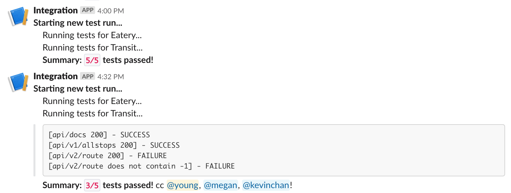

# integration
Run integration tests on deployed backends on an interval, and post results to Slack



## Setup

Environment variables can be found by asking a member of AppDev.

```bash
python3 -m venv venv
source venv/bin/activate
pip install -r requirements.txt
cd src
python main.py --local-only
```

## Features

Users are only tagged if there are test failures. If all tests for a particular app succeed,
the output is suppressed. In the case of a failure for an application, all test output is
sent to Slack, to make diagnosing the error easier.
